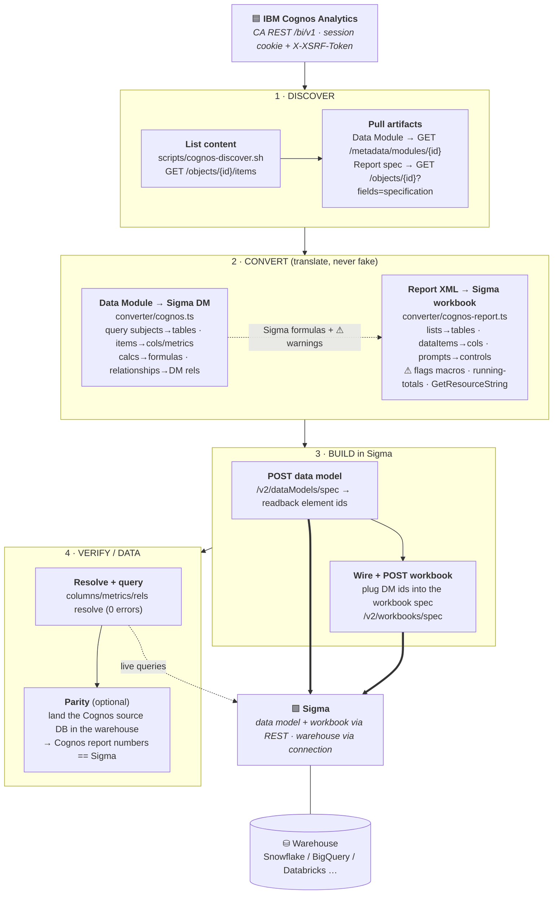

# Cognos → Sigma

Migrate **IBM Cognos Analytics** to **Sigma**:

- **Data Module JSON → Sigma data model** — query subjects → tables, query items → columns/metrics, calculations → Sigma formulas, relationships → DM relationships.
- **Report-spec XML → Sigma workbook** — lists → table elements, dataItems → columns, prompts → controls, filters surfaced for re-creation.

It translates the Cognos expression DSL where it maps cleanly and **flags what it can't** (runtime macros, running-totals, localization helpers) rather than emitting wrong logic — the same "flag, never fake" philosophy as the other `sigma-migration-skills` converters.

> **Status:** working MVP, validated on real IBM Cognos samples (Great Outdoors, GO sales performance, Telco churn, …). Laid out as a Claude Code **plugin** so it drops into [`sigma-migration-skills`](https://github.com/twells89/sigma-migration-skills)`/plugins/` when ready; the `converter/` is destined to vendor into `sigma-data-model-mcp` as `convert_cognos_to_sigma` MCP tools.

---

## The migration flow



---

## Translation coverage

| Cognos | Sigma | Status |
|---|---|---|
| Data Module · query subject | data model · table element | ✅ |
| Query item (attribute / fact + `regularAggregate`) | column / metric (`Sum`/`Avg`/…) | ✅ |
| Relationship (`link[].leftRef/rightRef` + cardinality) | DM relationship (source = many side) | ✅ |
| `total(x for a,b)` / aggregates | `SumOver(x,[a],[b])` / `Sum(x)` … | ✅ |
| `if (c) then (a) else (b)` | `If(c, a, b)` | ✅ |
| `_add_days/_add_months/_days_between`, `extract` | `DateAdd` / `DateDiff` / `DatePart` | ✅ |
| `substitute`, `substr`, `cast(x as char)`, `\|\|` | `RegexpReplace`, `Mid`, `Text`, `&` | ✅ |
| Report list + columns + `Summary()`/`Total()` footers | table element + columns + aggregate columns | ✅ |
| `prompt('p')` | control element | ✅ |
| Detail / summary filters | surfaced as warnings to re-create | ⚠ flagged |
| Runtime **macros** (`#…# prompt(…,'token',…)`) | `Switch([control])` placeholder | ⚠ flagged |
| `running-total`, `rank`, `lag/lead`, `GetResourceString` | — (no clean static analog) | ⚠ flagged |
| **Crosstab → pivot-table** (rows edge → rowsBy, columns edge → columnsBy, measure → values) | pivot-table element | ✅ |
| **Charts (RAVE2 `vizControl`)** — clustered/stacked bar & column, line, area, pie, donut, combo, bubble/scatter | bar / line / area / pie / donut / combo / scatter chart | ✅ |
| Cognos map / network / word-cloud / packed-bubble / treemap (no native Sigma chart) | flagged → table fallback | ⚠ flagged |
| Drill-through → actions, Framework Manager `.cpf` | — | ⛔ roadmap |

---

## Quickstart

```bash
cd skills/cognos-to-sigma/converter
npm install
# Data Module JSON → Sigma data model
node --import tsx/esm cli.ts ../fixtures/great-outdoors.module.json --database CSA --schema PUBLIC
# Report XML → Sigma workbook
node --import tsx/esm cli.ts ../fixtures/go-sales-performance.report.xml
npm test     # convert every bundled fixture
```

See **`skills/cognos-to-sigma/SKILL.md`** for the full discover→convert→build→verify workflow, **`QUICKSTART.md`** for a runnable walkthrough, and **`refs/`** for the Cognos REST/format notes + the expression-DSL mapping table.

## Layout

```
.claude-plugin/plugin.json          plugin manifest
skills/cognos-to-sigma/
  SKILL.md                          phased workflow (discover → convert → build → verify)
  QUICKSTART.md                     runnable on the bundled fixtures
  converter/                        the converter (→ vendors into sigma-data-model-mcp)
    cognos.ts                       Data Module JSON → Sigma data model
    cognos-report.ts                report-spec XML → Sigma workbook
    sigma-ids.ts                    shared Sigma id/name/format helpers
    cli.ts · test.ts · package.json
  scripts/cognos-discover.sh        CA REST discovery (session token)
  refs/                             design notes, format shapes, DSL mapping
  fixtures/                         real IBM Cognos sample modules + report
```
